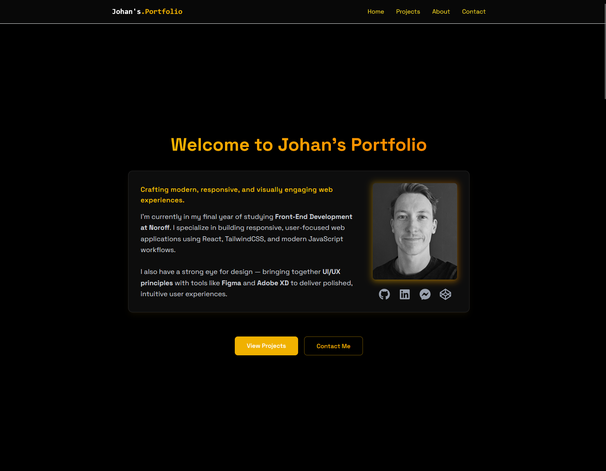

# Johan's Portfolio – Front-End Developer Showcase



A modern, responsive portfolio website built to showcase my front-end development projects and skills.  
This project serves as my professional online presence and part of my **Noroff Portfolio 2 – Course Assignment**.

---

## 📝 Description

This portfolio highlights my growth as a developer through a curated selection of projects from my studies at **Noroff School of Technology and Digital Media**.

The page includes:

- A professional "About Me" section
- A project gallery with screenshots, descriptions, and live links
- A responsive contact form powered by **EmailJS**
- Smooth scroll animations and a clean, modern UI built with **React** and **TailwindCSS**

### ✨ Key Features

- Fully responsive design across all screen sizes
- Built with modern web technologies (React + Vite)
- Animated scroll reveals for engaging user experience
- Integration with EmailJS for functional contact form
- Hosted with GitHub Pages

---

## 🧰 Built With

- [React.js](https://reactjs.org/)
- [Vite](https://vitejs.dev/)
- [TailwindCSS](https://tailwindcss.com/)
- [EmailJS](https://www.emailjs.com/)
- [React Icons](https://react-icons.github.io/react-icons/)
- [GitHub Pages](https://pages.github.com/)

---

## 🚀 Getting Started

### Installing

To get a local copy up and running, follow these steps:

1. Clone the repo:

```bash
git clone https://github.com/Johanf92/Portfolio-react.git
```

2. navigate

```
cd Portfolio-react
```

3. Install the dependencies:

```
npm install
```

### Running

To run the project locally:

```bash
npm run dev
```

Then open the URL displayed in your terminal (typically http://localhost:5173/).

## Contributing

This project is primarily for personal and educational purposes.
However, feedback, suggestions, and constructive criticism are always welcome!

If you wish to suggest improvements:

1. Fork the repo
2. Create a feature branch (git checkout -b feature/yourFeature)
3. Commit your changes (git commit -m 'Add feature')
4. Push to the branch (git push origin feature/yourFeature)
5. Open a pull request

## Contact

Created by: Johan Fredriksen

[Linkedin](www.linkedin.com)

[Github](www.github.com)
